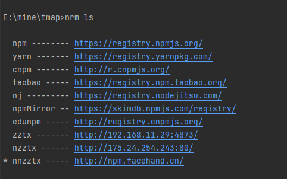
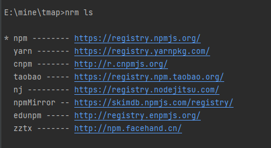

# 私库使用说明
查看[官方文档](https://www.npmjs.com/package/nrm) 获得 nrm 安装和使用方法  

私库最新地址： [http://npm.facehand.cn](http://npm.facehand.cn)

1. 查看本地使用的源  

```text
查看当前的源列表
nrm ls
```

  
   
2. 如果已有 zztx 但是不是最新的私库地址，先删除
   
```text
删除：
nrm del zztx
查看是否已经删除
nrm ls
```

2. 如果没有，或删除成功  http://npm.facehand.cn ，则添加

```text
nrm add zztx http://npm.facehand.cn
```

3. 运行 nrm ls 查看是否添加成功  


4. 运行 nrm use zztx 使用新的源

5. 正常 npm run install 即可


