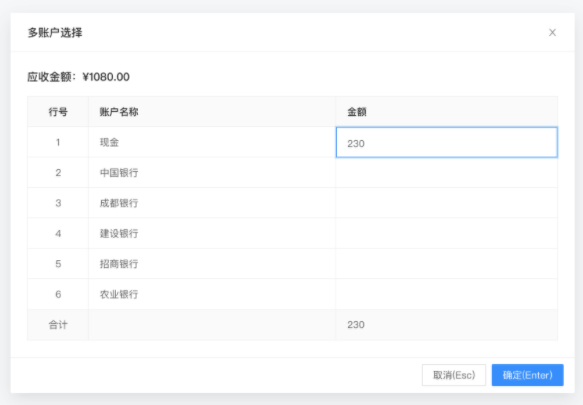
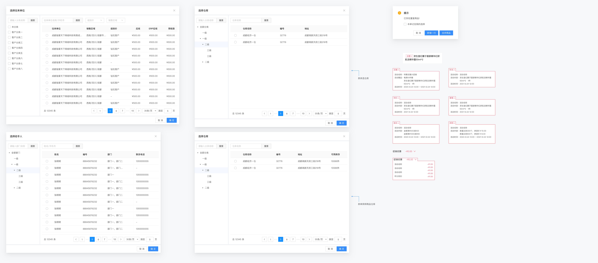
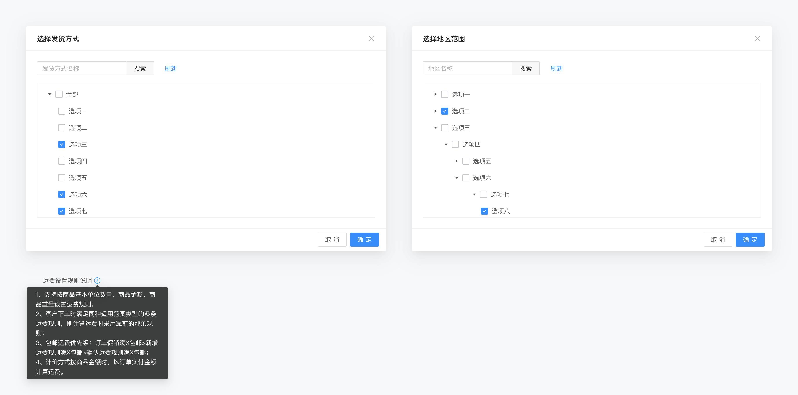
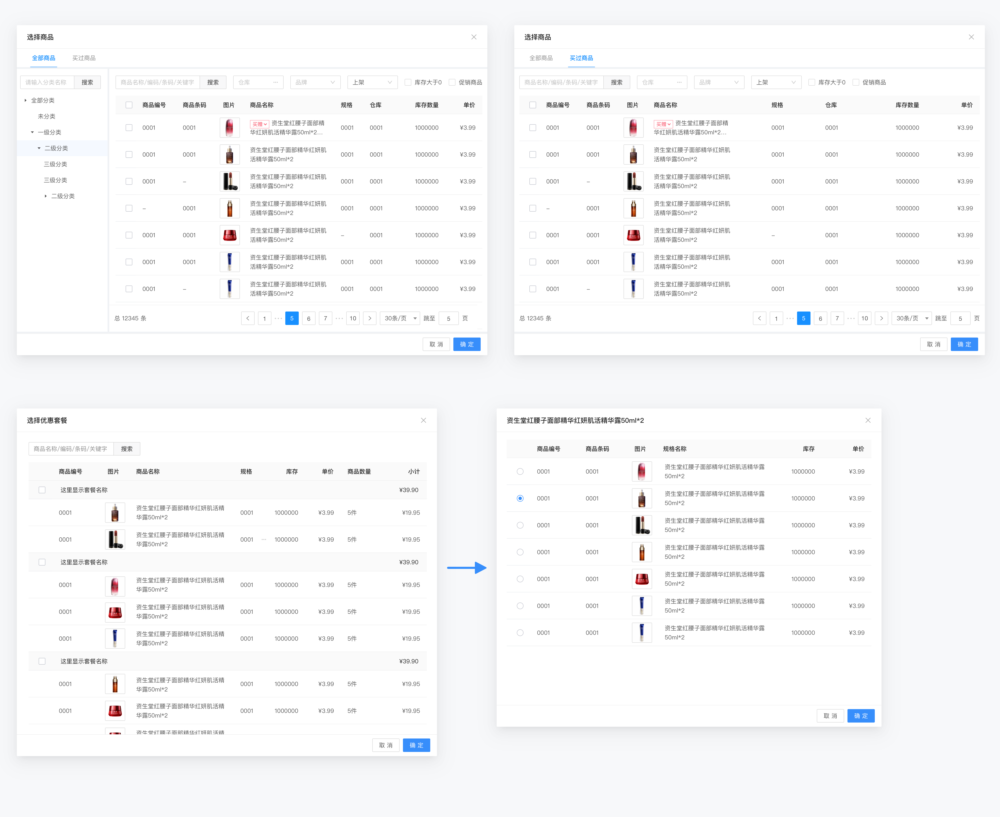
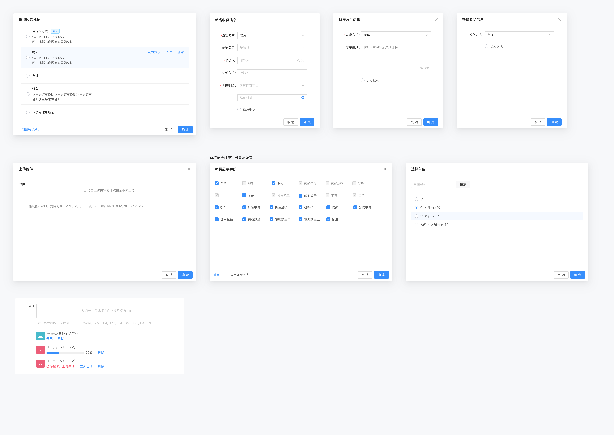

# 九月迭代 组件一览
1. 多账户与选择支付账户。（已有，注意处理选择账户和多账户的状态）  
  
   
2. 选择客户、仓库、经手人、特价套餐小组件，<a href="https://app.mockplus.cn/app/yIRmcqgNc/specs/design/jQDWkv2VTPfP" target="_blank">参考</a>  
> 1. 选择往来单位，已有 d-select-customer，注意行单击和双击的处理  
> 2. 选择仓库，已有 d-select-warehouse，视图切换为左右视图  
> 3. 选择经手人，已有 d-select-people，这个基本等于重做，数据来源于组织架构列表，即 <a href="https://dev.facehand.cn/pmweb/setting/organization">这里(/setting/organization)</a>  
> 4. 优惠小标签，没有  

  
   
3. 发货方式、地区范围，<a href="https://app.mockplus.cn/app/yIRmcqgNc/specs/design/ivcYYT9nDbXV" target="_blank">参考</a>
> 1. 选择发货方式，树形，没有  
> 2. 选择地区范围，姚航军已经在做了 


   
4. 选择商品、买过的商品、套餐选择、赠品选择，<a href="https://app.mockplus.cn/app/yIRmcqgNc/specs/design/iY26iJm408Mr" target="_blank">参考</a>  
> 1. 选择商品，已有 d-select-product，注意行单击和双击的处理    
> 2. 买过商品，扩展，没有  
> 3. 选择套餐，没有  
> 4. 套餐商品弹窗，没有  


   
5. 收货地址、收货信息，<a href="https://app.mockplus.cn/app/yIRmcqgNc/specs/design/N3TCKdD3eLBO" target="_blank">参考</a>
> 1. 选择收货地址，没有
> 2. 新增收货信息，没有，注意它的三个状态  
> 3. 销售字段自定义，订货项目下 /components/SetHeaderField，注意参数调整，注意他可能有排序的情况，<a href="https://app.mockplus.cn/app/yIRmcqgNc/specs/design/VRz5p-Sj061n" target="_blank">参考</a>  
> 4. 选择单位，已有 d-select-product-attr，注意处理 type  为 4 的时候会有换算率，即图中括号内的内容  


   

# 组件说明
1. 订货组件全部以 d 开头， 如 d-select-product  

# 组件需求
1. 面向业务线开发，怎么方便使用怎么来，外部调用组件尽量少的参数传递，组件内部方法尽量简单明了。  
2. 每个组件及时更新文档，有修改及时通知大家。  
3. 细节修改根据情况考虑是否全局修改提交代码，比如组件参数名变更等。  
4. 表格尽量用 stable，它封装了列显示隐藏，非常奈斯。
5. 绑定数据尽量用 v-model  

# 一些组件规划
## 参数统一
visible 弹窗  
title 标题  
sortList 列表排序  
beforeClose 关闭弹窗前  
multiple 是否多选  
cache 是否缓存  
replaceFields 替换值，这个要做支持部分设置  
rules 查询条件  
origin 来源  
defaultValue 默认值  

## 回调统一
> 根据实际情况定，非主线需求不强制，如组件内部的小组件，注意这里的需求是，提供到最外面的，非特殊情况，都采用这两个回调，原因是涉及到组件嵌套的时候统一回调处理。  
change 组件变化  
confirm 弹窗组件确定  
```javascript
// 回调全部放置于一个对象中
this.$emit('change', {
    data: undefined, // 选中的数据等,
    rows: undefined, // 选中的数据源,
    config: { // 非必要的，根据实际情况使用，参考 mix-Search 以及 mixins-search
        resultName: '', // 这个参考 d-mixins-search
        // 其余返回看需要
    }
})
```

## 未完成的项目
1. 弹窗列表中 rules 查询条件的处理  
2. 弹窗列表中 defaultValue 的处理  
3. 弹窗中缓存的处理  
4. 弹窗中涉及到分类的列表，都要改成左右形式，参考 select-customer  
5. 弹窗中的选择，不管是表格还是单选多选如选商品和选商品属性，双击效果和点击确认按钮一样  
6. 选择商品弹窗，不同的商品类型显示的列不一样，需要做区分，参考： headerConfig
7. 在 mix-search 中输入内容后对应弹窗中的检索条件处理

## 未完成的组件
1. d-mixins-search 混合搜索 mixins，还没有做完整的组件可行性验证  
2. d-more-search 封装常用的查询条件，并可以根据参数设置需要的组件  
