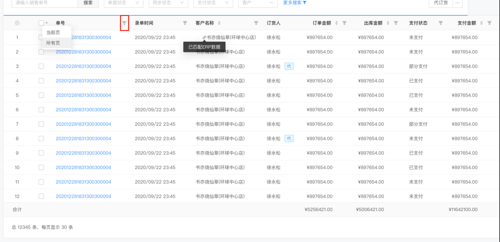

# 表头筛选



## 使用

```vue
<template>
  <div class="">
    <a-table>
      <a-table-column
        title="筛选"
        :filter-dropdown-visible.sync="tagsFilterDropdownVisible"
      >
        <d-filter-dropdown
          slot="filterDropdown"
          slot-scope="{
            setSelectedKeys,
            selectedKeys,
            confirm,
            clearFilters,
            column,
          }"
          :data="{
            setSelectedKeys,
            selectedKeys,
            confirm,
            clearFilters,
            column,
          }"
          @confirm="changeHandle"
          name="amount"
          :visible.sync="tagsFilterDropdownVisible"
        />
      </a-table-column>
    </a-table>
  </div>
</template>

<script>
import { DFilterDropdown } from "@handday/components";
export default {
  name: "mixSelect",
  components: {
    DFilterDropdown,
  },
  data() {
    return {
      tagsFilterDropdownVisible: false,
    };
  },
  methods: {
    changeHandle(value, column, data) {
      console.log(value, column, data);
    },
  },
};
</script>
```

### Attributes

| 名称          | 类型             | 默认  | 说明                                                                                         |
| ------------- | ---------------- | ----- | -------------------------------------------------------------------------------------------- |
| value/v-model | 根据实际情况而定 | -     | 暂未实现，组件数据，通常不应该使用此值                                                       |
| name          | String           | -     | 组件名称                                                                                     |
| config        | Object           | -     | 基础配置项                                                                                   |
| visible       | Boolean          | false | 指定情况下需要设置，参考 ** visible ** 特别说明，参考，与 :filter-dropdown-visible.sync 一致 |
| list          | Array            | -     | 传入自定义筛选列表                                                                           |

#### name

| 值                 | 说明               |
| ------------------ | ------------------ |
| input              | 输入框             |
| range              | 时间区间           |
| amount             | 金额               |
| payment            | 支付状态           |
| bill               | 单据状态           |
| inStock            | 入库状态           |
| outStock           | 出库状态           |
| sales              | 上下架状态         |
| stockBill          | 盘点状态           |
| handler            | 经手人             |
| preparer           | 制单人             |
| stockSync          | 库存状态           |
| paymentMode        | 付款方式           |
| exchangePayment    | 应收应付           |
| supplier           | 供货商             |
| customer           | 客户               |
| unit               | 商品单位           |
| brand              | 商品品牌           |
| tag                | 商品标签           |
| payStock           | 付款单相关同步状态   |
| billSource         | 订单来源           |
| deliveryMethod     | 发货方式           |
| customerLevelPrice | 客户级别价         |
| saleArea           | 销售区域           |
| invoiceType        | 发票类型           |
| printStatus        | 打印状态           |
| erpSyncStatus      | 同步状态           |

### visible 特别说明

当筛选条件需要调起弹窗的时候，需要给对应的列设置这个值

### Events

| 名称   | 返回值            | 说明       |
| ------ | ----------------- | ---------- |
| change | value, name, data | 选择后回调 |

### methods

| 名称      | 返回值 | 说明                           |
| --------- | ------ | ------------------------------ |
| resetData |        | 重置数据，传入 true 会调用回调 |
