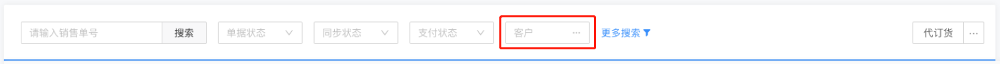

# 混合搜索框



## 交互说明

1. 输入框输入内容，用户敲击回车，进行查询，如果结果集中有匹配的值则返回，没有匹配则打开弹窗并传入输入的值。
2. 输入内容失去焦点，同回车。
3. 在 restore 状态下，一旦选中禁止删除，用户输入值后回车没有匹配到，打开弹窗，如果没有选择内容关闭弹窗，值应为改变之前的值
4. 弹窗内回调 [弹窗选择](/dh/development/table)
5. 没有改变不发生回调。
6. 此组件不做任何数据转换处理，仅转发

## 基础使用

```vue
<template>
  <div class="">
    <d-mix-search v-model="selectValue" name="product" />
  </div>
</template>

<script>
import { DMixSearch } from "@/handday/components";
export default {
  name: "MixSearch",
  components: {
    DMixSearch,
  },
  data() {
    return {
      selectValue: undefined,
    };
  },
};
</script>
```

### Attributes

| 名称         | 类型              | 默认  | 说明                                                                                                                                     |
| ------------ | ----------------- | ----- | ---------------------------------------------------------------------------------------------------------------------------------------- |
| value        | [String, Object]  | -     | 绑定值                                                                                                                                   |
| name         | String            | ''    | 组件名称                                                                                                                                 |
| width        | Number            | 240   | 宽度                                                                                                                                     |
| placeholder  | String            | -     | placeholder                                                                                                                              |
| disabled     | Boolean           | -     | 是否禁用                                                                                                                                 |
| maxLength    | Number            | 40    | 支持的最大字符数                                                                                                                         |
| restore      | Boolean           | false | 是否要还原为上一次的值                                                                                                                   |
| next         | Function          | -     | 下一步的回调                                                                                                                             |
| valueMode    | [Boolean, String] | -     | <b style="color:red;">true</b>： 输入框已经匹配有值的时候单选，反之打开弹窗多选，<b style="color:red;">select</b>： v-model 将不发生改变 |
| dialogConfig | Object            | -     | 对应打开的弹窗的配置项，注意查看每个弹窗的说明                                                                                           |

#### name

| 值               | 说明                         |
| ---------------- | ---------------------------- |
| product          | 商品                         |
| couponProduct    | 订货单选择商品               |
| recommendProduct | 商品推荐商品列表             |
| purchaseProduct  | 采购和其它出入库单据选择商品 |
| rateProduct      | 带单位换算的商品             |
| multipleProduct  | 多选                         |
| person           | 经手人                       |
| warehouse        | 仓库                         |
| customer         | 客户                         |
| supplier         | 供应商                       |
| supplierCustomer | 客户和供应商都有             |
| unit             | 商品单位                     |
| brand            | 品牌                         |
| tag              | 标签                         |
| account          | 付款账户选择                 |
| delivery         | 发货方式                     |
| logistics        | 系统初始物流公司             |
| customLogistics  | 自定义物流公司               |
| address          | 收货信息                     |

### Events

| 名称   | 返回值      | 说明       |
| ------ | ----------- | ---------- |
| change | value, data | 选择后回调 |

#### change
| 值   | 说明       |
| ------ | ---------- |
| config | 基本配置信息 |
| data | 数据 |
| rows | 行数据 |
| reset | 重置 |
| multiple | 是否多选 |

### 仅做选择不做回显
> value-mode 为 select，此时仅做选择，但是有个弊端无法无法满足单选多选自动切换，但是可以通过 dialog-config.multiple 进行配置强行切换选择类型  
> 可在 change 回调中直接调用 reset 方法将内部选中数据进行重置，这种做法没有任何附加影响，强制清除当先输入框中数据，然后再自行处理赋值问题  

#### 基础配置使用一览

> dialogConfig 中的参数与对应弹窗有关

```vue
<template>
  <DMixSearch
    name="product"
    v-model="selectValue"
    placeholder="请输入"
    disabled
    :maxLength="100"
    valueMode
    :dialog-config="{
      // 弹窗配置
      replaceFields: {
        // 商品的主键
        key: 'id',
      },
      rules: {
        // 注意这项的内容需要查看对应的弹窗接收的值
        warehouse: {
          // 仓库，没有不传或传 null
          id: 1,
          name: '9999',
          disabled: true, // true 表示禁用仓库按钮
        },
      },
      defaultValue: {
        // 商品，没有传 null
        id: '78901515906027520',
        name: '哇哇橘',
      },
    }"
    :next="checkNext"
  />
</template>
```
