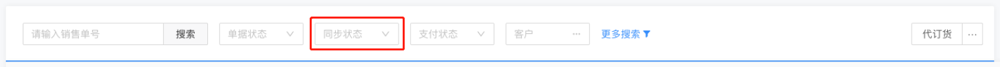

# 混合下拉框



> 这个组件出扩展功能以外，其余参数与 a-select 保持一致

## 使用

```vue
<template>
  <div class="">
    <d-mix-select v-model="selectValue" :type="2" />
  </div>
</template>

<script>
import { DMixSelect } from "@handday/components";
export default {
  name: "mixSelectDemo",
  components: {
    DMixSelect,
  },
  data() {
    return {
      selectValue: undefined,
    };
  },
};
</script>
```

### Attributes

| 名称        | 类型             | 默认     | 说明              |
| ----------- | ---------------- | -------- | ----------------- |
| value       | [String, Number] | -        | 绑定值            |
| type        | Number           | 0        | 加载类型          |
| disabled    | Boolean          | false    | 禁用状态          |
| allowClear  | Boolean          | false    | 是否允许删除      |
| placeholder | String           | -        | placeholder       |
| width       | String,Number    | -        | 宽度，可不传      |
| list        | Array            | -        | 选项列表          |
| exclude     | Array            | -        | 需要过滤掉的 id   |
| mode        | String           | 'select' | 'select/multiple' |

#### type

| 值  | 说明         |
| --- | ------------ |
| 0   | 商品单位     |
| 1   | 商品品牌     |
| 2   | 商品标签     |
| 3   | 单据状态     |
| 4   | 支付状态     |
| 5   | 库存状态     |
| 6   | 上下架状态   |
| 7   | 应收应付     |
| 8   | 同步状态     |
| 9   | 库存单据状态 |
| 10  | 出入库类型   |
| 11  | 级别价       |
| 12  | 订单状态     |
| 13  | 打印状态     |
| 14  | 发货方式     |
| 15  | 单据来源     |
| 16  | 营销类型     |
| 17  | 发票类型     |

### Events

| 名称   | 返回值      | 说明       |
| ------ | ----------- | ---------- |
| change | value, data | 选择后回调 |
