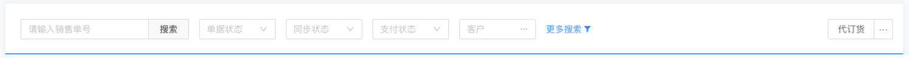
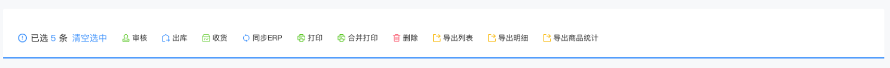

# 选项操作栏

  

## 使用
> 使用参考项目下 components/operation/demo  
```vue
<template>
  <div>
    <d-operation-box v-model="selectList" :optionList="optionList" :rowSelectKeys="rowSelectKeys" @optionClick="optionHandle" @change="changeHandle">
      <d-mix-select v-model="searchResult.brand" :type="1" allowClear style="width:100px; margin-right:16px;" @change="(...args) => selectHandle('brand', ...args)" />
      <d-mix-select v-model="searchResult.tag" :type="2" allowClear style="width:100px; margin-right:16px;" @change="(...args) => selectHandle('tag', ...args)" />
      <d-mix-select v-model="searchResult.order" :type="3" allowClear style="width:100px;" @change="(...args) => selectHandle('order', ...args)" />
    </d-operation-box>
  </div>
</template>

<script>
import { TableSelection, DMixSelect, DOperationBox } from '@handday/components'
export default {
  name: 'OperationDemo',
  components: {
    DOperationBox,
    DMixSelect
  },
  mixins: [TableSelection],
  provide () {
    return {
      selectionContent: this.selectionContent,
      pagination: this.pagination
    }
  },
  data () {
    return {
      selectList: {},
      selectKey: {
        brand: '品牌',
        tag: '标签',
        order: '单据状态'
      },
      optionList: [
        { name: '过账', key: 'guozhang', icon: 'icon_warning', iconColor: 'red', size: 16, loading: true },
        { name: '导出明细', key: 'detail', icon: 'iconshanchu1', iconColor: 'blue', size: 16, loading: undefined },
        { name: '删除', key: 'delete', icon: 'iconweixin', iconColor: 'yellow', size: 16 }
      ],
      searchResult: {
        brand: undefined,
        tag: undefined,
        order: undefined
      },
      rowSelectKeys: []
    }
  },
  methods: {
    /**
     * optionList 回调
     * name 操作的 key，更多筛选返回 more；清空选中返回 clear
     * callback 有加载按钮的时候调用以关闭加载状态
     * */
    optionHandle (name, callback) {
      console.log('optionHandle:', name)
      setTimeout(() => {
        callback()
      }, 1000)
    },
    /**
     * 内部条件变化
     * */
    changeHandle (deleteName) {
      if (deleteName === 'all') {
        this.resetResult()
      } else {
        this.searchResult[deleteName] = undefined
      }
    },
    /**
     * 下拉框选择了某项
     * */
    selectHandle (...args) {
      const key = args[0] // 当前操作的下拉框的名称
      const result = args[2] // 数据对象
      if (result) {
        this.selectList[key] = {
          key: key,
          label: this.selectKey[key],
          value: result.name,
          ...result
        }
      } else {
        delete this.selectList[key]
      }
      this.selectList = {
        ...this.selectList
      }
      // 这里写后续的回调方法
    },
    /**
     * 清空回调
     * */
    resetResult () {
      this.searchResult = {
        brand: undefined,
        tag: undefined,
        order: undefined
      }
    }
  }
}
</script>

<style lang="less" scoped></style>

```

### Attributes
| 名称 | 类型 | 默认 | 说明 |
| --- | --- | --- | --- |
| value | [String, Number] | - | 绑定值 |
| selectList | Array | - | 选中的值 |
| optionList | Array | - | 增加的按钮 |
| moreSearch | Boolean | true | 更多搜索 |
| modelConfig | Object | - | 更多弹窗 |

### 必须参数
参考示例代码 provide

#### optionList

```javascript
[{
    name: '',
    key: '',
    icon: '',
    iconColor: '#378EFB',
    textColor: '#378EFB',
    size: 16,
    loading: undefined
}]
```

#### modelConfig

```javascript
{
    title: '',
    okText: '确定',
    cancelText: '取消',
    ok: () => {
    that.visible = false
    },
    width: 'auto',
    maskClosable: false,
    keyboard: false,
    style: '',
    class: '',
    cancel: () => {
        that.visible = false
    }
}
```

### slots
| 名称 | 说明 |
| --- | --- |
| default | 默认的插槽 |
| other | 其它按钮，如新增按钮等 |
| modal | 弹窗插槽，配置项为 modelConfig |

### Events
| 名称 | 返回值 | 说明 |
| --- | --- | --- |
| delete | name | 删除筛选条件 |
| optionClick | name, callback | 自定义按钮的点击事件以及 loading 的关闭回调 |
